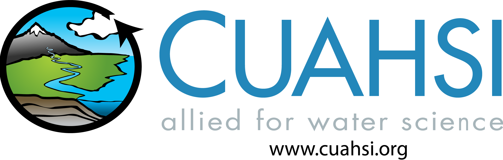

# Water-Content-Portal
 

Repository for hosting open learning materials for the water science community. More info coming soon.

### Building the website locally

A set of instructions on how to build the portal locally is under the [local build documentation](book/local_build.md). 

### Information on deployment to production

We have configured DNS CNAME to point at Netlify:
* [Netlify Configuration](https://app.netlify.com/projects/cuahsi-water-portal/domain-management#production-domains)
* [GCP DNS](https://console.cloud.google.com/net-services/dns/zones/cuahsi-io/rrsets/water-content-portal.cuahsi.io./CNAME/view?project=apps-320517)