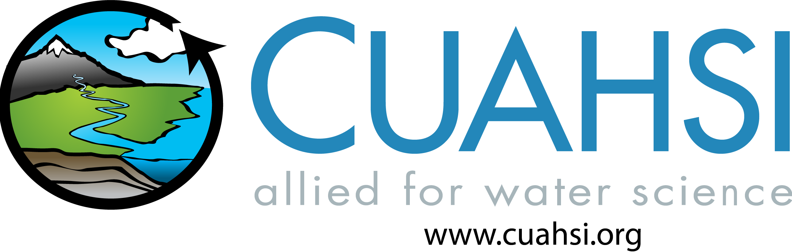

# Water-Content-Portal
 

The **CUAHSI Water Content Portal** is a community-driven repository for hosting and sharing open learning materials within the water science community. This platform organizes educational materials into five categories: Courseware, Code Labs, Workshops, Standards & Protocols, and Impact Stories. By bringing these materials together in a single accessible space built with Jupyter Book, it serves as a central hub for water researchers and educators.

## Adding External Content via Git Submodules

This portal aggregates content from various external repositories using Git submodules. If you are a maintainer looking to add new materials to the portal, you can link an external repository directly into the portal's directory structure. Below is an example of how to add the first chapter of the [Hydroinformatics book](https://www.hydroinformaticsbook.com/) hosted at https://github.com/VT-Hydroinformatics/1-Intro-plotting-R.

### 1. Add the Git Submodule

From the root of this repository, use the `git submodule add` command to specify the branch, the repository URL, and the exact destination path in a single step.

```bash
git submodule add -b master https://github.com/VT-Hydroinformatics/1-Intro-plotting-R book/courseware/hydroinformatics/1-Intro-plotting-R
```

This command clones the `master` branch of the target repository into the specified folder and updates the `.gitmodules` file to track the external source.

### 2. Update the Table of Contents

For the new content to appear on the website, you must add it to the portal's navigation structure. Open the `book/myst.yml` file and locate the section where the new content belongs. Add the relative path to the markdown file (.md) or Jupyter Notebook file (.ipynb) you want to display.

To include the plotting demo from the repository we just added, your `myst.yml` configuration would look like this:

```yaml
- file: courseware/courseware.md
      children:
        - file: courseware/hydroinformatics/Front_Matter/hydroinformatics.md
          children:
            - file: 'courseware/hydroinformatics/1-Intro-plotting-R/01-Plotting_Demo_COMPLETE.md'
```


### 3. Build and Preview Locally

It is important to verify that the new pages build and render correctly before pushing your changes. Please refer to the [local build documentation](book/local_build.md) for complete setup instructions.

The standard local testing workflow requires you to:
- Initialize and update all submodules by running `make update`
- Start the local Jupyter Book server by running `make serve`

### 4. Commit Your Changes

Once you confirm the local build looks correct, you can stage and commit your changes. Make sure you include the updated `.gitmodules` file, the new submodule directory, and the modified `book/myst.yml` file.

## Removing a Git Submodule

If you need to remove external content from the portal, you must properly delete the submodule from git. Deleting the folder directly will cause git tracking errors.

To remove a submodule run the following commands, replacing the path with the directory of the submodule you wish to remove:
```bash
# Remove the submodule from the git cache, update the .gitmodules file, and delete the local directory
git rm book/courseware/hydroinformatics/1-Intro-plotting-R

# Remove the internal git directory for the submodule to prevent future conflicts
rm -rf .git/modules/book/courseware/hydroinformatics/1-Intro-plotting-R
```

## Information on Deployment

### Production 
We have configured DNS CNAME to point at Netlify:
* [Netlify Configuration](https://app.netlify.com/projects/cuahsi-water-portal/domain-management#production-domains)
* [GCP DNS](https://console.cloud.google.com/net-services/dns/zones/cuahsi-io/rrsets/water-content-portal.cuahsi.io./CNAME/view?project=apps-320517)

### Develop
We also have the `develop` branch deployed at [https://develop--cuahsi-water-portal.netlify.app/](https://develop--cuahsi-water-portal.netlify.app/)

