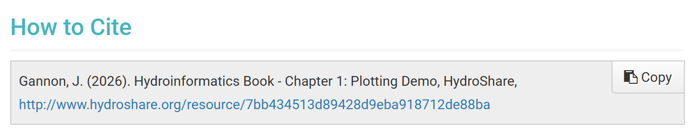

:::{div .no-sidebar-marker}
:::

The content of the CUAHSI Water Learning Hub is licensed for free and open use under the Creative Commons Attribution 4.0 International (CC BY 4.0) license. All materials are designed to be reusable and citable to support open science and improve the findability, accessibility, interoperability, and reuse (FAIR) of these educational resources.

## How to Cite

Each collection and page in this portal is associated with a corresponding resource in [HydroShare](http://hydroshare.org/).

There are two ways to cite content, depending on what you are referencing:

### Citing a Collection (e.g., a book)

If you are referencing a full set of materials, such as the Hydroinformatics book, cite the **HydroShare collection resource**.

Use this when:
- You are referring to the book or collection as a whole  
- You are describing the overall structure or content  
- You are not referencing a specific chapter or page  

### Citing a Page (e.g., a chapter)

If you are using or referencing a specific tutorial, workflow, or chapter, cite the **individual HydroShare resource for that page**.

Use this when:
- You are citing a specific chapter or example  
- You are using code, figures, or methods from a page  
- You want to point readers to a precise resource  

### Steps

1. Navigate to the HydroShare resource linked on the page  
2. Use the provided citation (recommended) or DOI  

A typical citation will look like the following in HydroShare:

## Citing the Entire Portal

The complete collection of open learning materials is available here: 
https://www.hydroshare.org/resource/1c64dbc324bd46889b38a576bddb5a5a/

You can cite this resource when referring to the full portal. In most cases, it is preferable to cite a specific collection or page to provide a more precise reference.

## Questions or Contributions

If you have questions about citation or are interested in contributing materials, please visit the [Contribute](/contribute) section of this site.