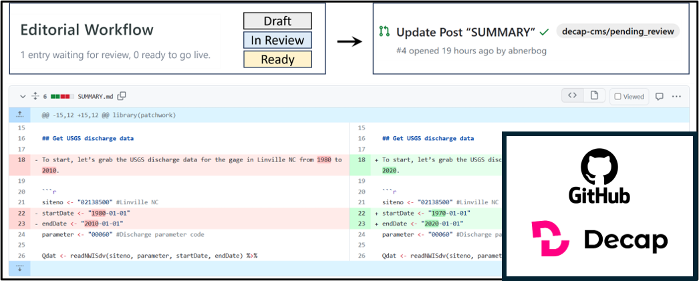
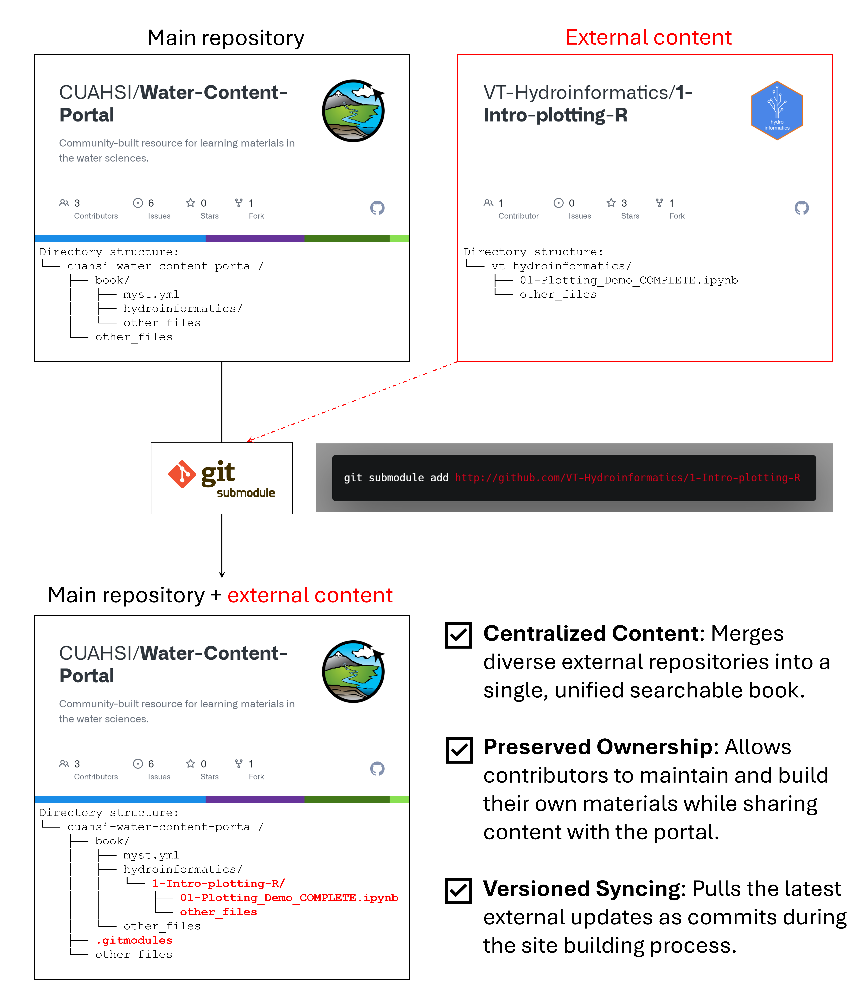
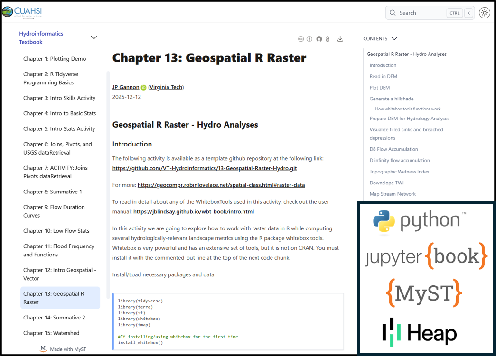
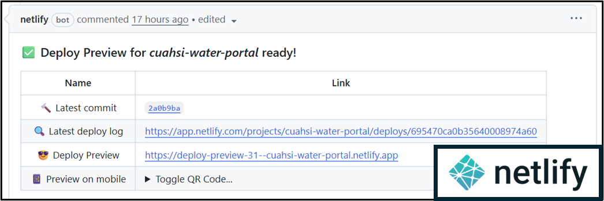

---
# Frontmatter for contribute.md
title: Guide for Contributing to the CUAHSI Water Content Portal
github: https://github.com/CUAHSI/Water-Content-Portal/blob/main/book/contribute.md
edit_url: https://github.com/CUAHSI/Water-Content-Portal/edit/main/book/contribute.md 
date: 2026-01-07
author:
    - name: CUAHSI
---

The **CUAHSI Water Content Portal** is a community-driven resource. We rely on contributions from water science researchers and educators to keep our learning materials accurate and comprehensive.

## Ways to Contribute

There are three primary ways you can help improve this resource:

1. **Suggesting Changes:** Reporting typos, broken links, or platform bugs.
2. **Editing Existing Content:** Updating text or code in markdown-based content or computational narratives (e.g., Jupyter Notebooks).
3. **Syncing External Content:** Notifying us when a external repository existing in the platform has been updated.

## Suggesting Platform Edits

If you notice an issue with the website itself (navigation, styling, or general errors), please do one of the following:

* **Create a GitHub Issue:** Visit our [Main Repository](https://github.com/CUAHSI/Water-Content-Portal) and open an issue.

* **Email Us:** You can also reach out directly to **help@cuahsi.org** with your suggestions.

## Editing Existing Content

### Using the "Edit" Buttons

Some pages in the portal currently include a pencil and paper edit button at the top. Please note that clicking this edit button will redirect you away from this portal to the repository where the source content actually lives. The edit button can take you to different ways to contribute content:

* **GitHub (Standard):** For computational narratives (Jupyter Notebooks) and some markdown files, you will be directed to make edits in GitHub.

* **Decap CMS (In Development):** For users newer to GitHub and making edits on certain markdown-based content, we are implementing a simplified workflow via a user-friendly and Git-synced content management system called [Decap CMS](https://decapcms.org/).

## Updating External Content (via Git submodules)

Because this portal aggregates content from various external repositories using [**Git submodules**](https://git-scm.com/book/en/v2/Git-Tools-Submodules), updates made to a source repository do not always appear here automatically. A description of this workflow is below:

If you have updated a chapter or notebook in an external repo (e.g., chapter 2 in the Hydroinformatics E-book) and want to see it reflected in the portal:

1. **Open a GitHub Issue** in the [Water-Content-Portal repository](https://github.com/CUAHSI/Water-Content-Portal).
2. **Title the Issue:** E.g., "Update to Hydroinformatics Textbook"
3. **Provide Details:** Briefly mention which chapters or files were updated so the core team can run a `make update` to sync the changes.

### Building the Portal Locally to Preview Changes

If you want to preview your contributions before submitting them, you can build the book on your local machine:

1. Clone the repo: `git clone git@github.com:CUAHSI/Water-Content-Portal.git`.

2. Create the environment: `conda env create --file environment.yml`.

3. Update content in external repo: `make update`.

4. Serve the book: `make serve`.

For more detailed steps, see the [Local Build Instructions](local_build.md).

## Technical Architecture

This platform is built using the [**Jupyter Book**](https://pypi.org/project/jupyter-book/) Python package and [**MyST Markdown**](https://mystmd.org/), allowing for the integration of computational narratives (e.g., Jupyter Notebooks) and standard documentation. We use [**Heap Analytics**](https://www.heap.io/) to track how each resource is being used by the community. 

The site is deployed via the web hosting serive [**Netlify**](https://www.netlify.com/). 

