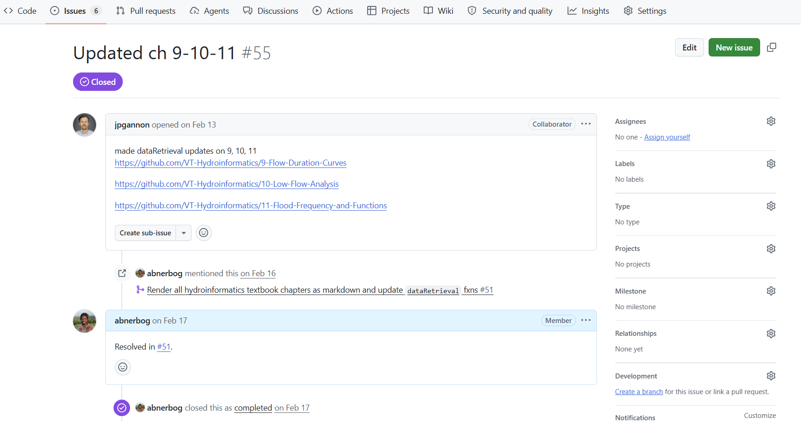
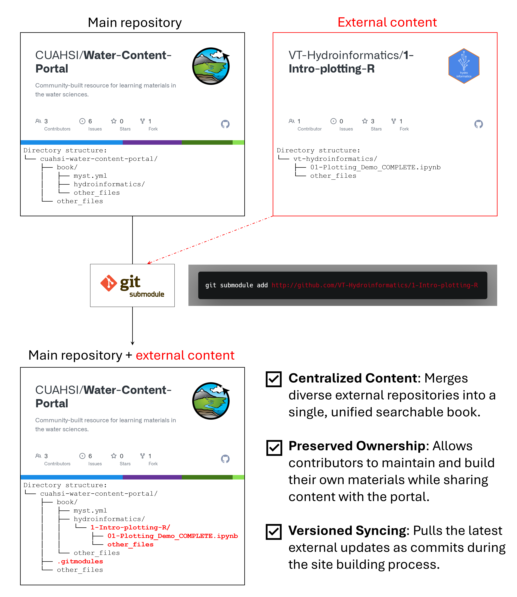

The **CUAHSI Water Content Portal** is a community-driven resource. We rely on contributions from water science researchers and educators to keep our learning materials accurate and comprehensive.

# Ways to Contribute

There are three primary ways you can help improve this resource:

1. **Suggesting Platform Edits:** Reporting typos, broken links, or platform bugs.
2. **Request to Add Your Existing Content:** If you have educational water learning materials on GitHub that you would like to be hosted on our platform, please reach out to **help@cuahsi.org** with a link to your educational material(s) and a description of how and where this fits in the CUAHSI Water Content Portal.
3. **Keep Your Content in the Portal Up-to-Date:** Once your content is added to the portal, notify us in a [GitHub issue](https://github.com/CUAHSI/Water-Content-Portal/issues) when your repository existing in the platform has been updated, e.g. individual chapters in the Hydroinformatics book:

- _Note: When you update your content, you will also need to follow [these instructions](making-content-citable.md) to update the citation of your resource in HydroShare following_.

# Content Managment Workflow

This portal aggregates educational resources directly from contributor's external repositories using [**Git submodules**](https://git-scm.com/book/en/v2/Git-Tools-Submodules). A description of this workflow is described below using [Chapter 1 of the Hydroinformatics book](https://water-content-portal.cuahsi.io/plotting-demo-complete/) as an example:

This approach has served as an facile and effective way to ingest and update content in a trackable manner. 