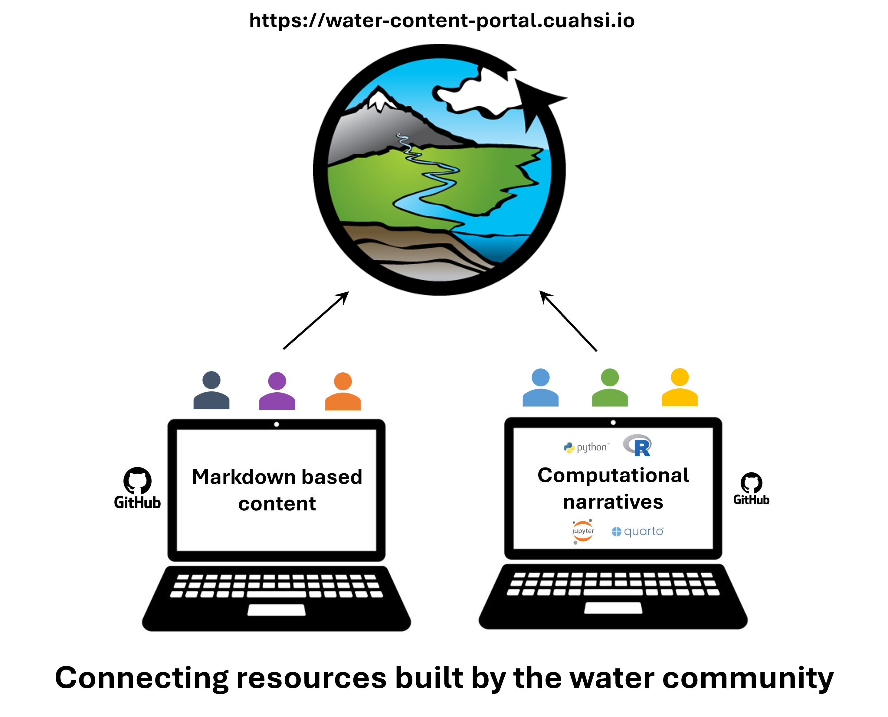

Welcome to the **CUAHSI Water Content Portal**, a community-built resource for hosting and sharing open learning materials in the water sciences.

## About this Resource

This portal aggregates diverse educational content for water researchers into a single, accessible book.

### Community-sourced content

Current open learning resources available in the CUAHSI Water Content Portal include the following:

* **Hydroinformatics E-book**: A comprehensive course on data analysis techniques in hydrology using the R programming language, authored by [JP Gannon](https://jpgannon.github.io/), associate professor at Virgnia Tech. Topics range from basic plotting and statistics to flow duration curves and flood frequency analysis.
* **Data Collection Protocols Repository**: Collection of standard operating procedures for data collection methods used in the lab and field in the water sciences. 
    * _**Note: this section is in development.**_

## Getting started

The CUAHSI Water Content Portal is not meant to be read from start to finish. Browse the different guides that make up the book, or use the search box to search for whatever you would like to learn about first.

## Guide for Collaboration

To get started with contributing or building the webpage locally, please see the [Contribution Guide](contribute.md) and the [Local Build Instructions](local_build.md). 