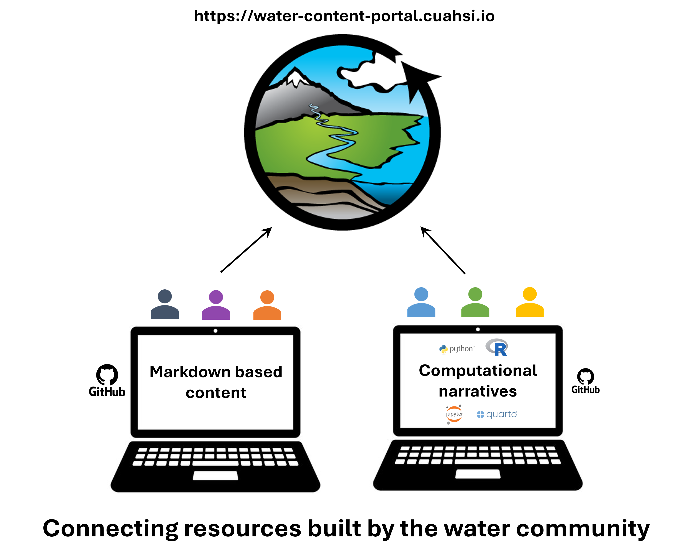

Welcome to the **CUAHSI Water Content Portal**, a community-built resource for hosting and sharing open learning materials in the water sciences.

## About this Resource

This portal aggregates diverse educational content for water researchers into a single, accessible book.

### Community-sourced content

The CUAHSI Water Content Portal organizes resources into several key categories to support different learning and professional needs:

* **[Courseware: Structured Academic Curriculum](courseware/index.md)**: Semester-long paths, syllabi, and lecture series for formal education.
* **[Code Labs: Interactive & Computational Labs](code-labs/index.md)**: The "Workbench" for applied technical skills and reproducible science using Jupyter and R.
* **[Workshops: Micro-Learning & Professional Development](workshops/index.md)**: Short modules and technical webinars for rapid upskilling.
* **[Standards & Protocols: Field Protocols, Instrumentation & Data Policy](standards-and-protocols/index.md)**: Standard operating procedures and technical manuals to ensure data quality.
* **[Impact Stories: Case Study & Data Repositories](impact-stories/index.md)**: Real-world case studies and data reports contextualizing water science theory.

## Getting started

The CUAHSI Water Content Portal is not meant to be read from start to finish. Browse the different guides that make up the book, or use the search box to search for whatever you would like to learn about first.

## Guide for Collaboration

To get started with contributing or building the webpage locally, please see the [Contribution Guide](contribute.md) and the [Local Build Instructions](local_build.md). 