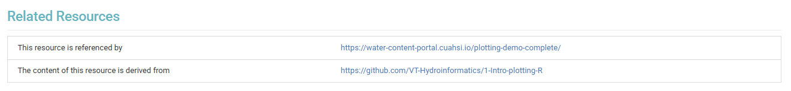

# Overview 

All educational resources in the CUAHSI Water Learning Hub are designed to be reusable and citable to support open science practices in the water community and improve the findability, accessibility, interoperability, and reuse (FAIR) of these resources. To enable this, each educational resource (or collection of resources) is associated with a corresponding [HydroShare](https://hydroshare.org/) resource, and is a part of the [CUAHSI Water Learning Hub HydroShare collection](https://hydroshare.org/resource/1c64dbc324bd46889b38a576bddb5a5a/). 


# Steps to Cite Your Resources

To ensure your contributions are properly credited and tracked, we ask all contributors to establish a clear link between their content in GitHub, HydroShare and the CUAHSI Water Learning Hub. Follow the steps below to make your educational materials citable:

## 1. Create a HydroShare Resource

Begin by creating a new resource (or a new version of an existing resource) in HydroShare specifically for your page (e.g., [Chapter 1 of the Hydroinformatics book](https://hydroshare.org/resource/7bb434513d89428d9eba918712de88ba/)) or collection (e.g., [the full Hydroinformatics book](https://hydroshare.org/resource/11ed41bf6d1a4754a1db4361a3a8db3b/)). This establishes a permanent home for your educational content and generates the necessary identifiers for citation.

## 2. Update Page-level Frontmatter

Once your HydroShare resource is created, you need to link it directly to your source files. Add the HydroShare URL and the placeholder DOI to the page-level frontmatter of your `.md` or `.ipynb` file. 


Your YAML configuration at the top of the file should look similar to this (note the HydroShare resource and DOI in the `venue` and `doi` fields):

```yaml
---
title: "Chapter 1: Plotting Demo"
date: 2026-03-23
authors:
  - id: jpgannon
    name: JP Gannon
    email: jpgannon@vt.edu
    github: jpgannon
    orcid: 0000-0002-4595-3214
    corresponding: true
    url: https://jpgannon.github.io/
    affiliations:
      - vt-tech
affiliations:
  - id: vt-tech
    name: Virginia Tech
    url: https://www.vt.edu/
subject: Courseware
doi: https://doi.org/10.4211/hs.7bb434513d89428d9eba918712de88ba
venue:
  title: View Resource on HydroShare
  url: https://hydroshare.org/resource/7bb434513d89428d9eba918712de88ba/
github: https://github.com/VT-Hydroinformatics/1-Intro-plotting-R
downloads:
  - file: 01-Plotting_Demo_COMPLETE.md
  - file: 01-Plotting_Demo_COMPLETE.pdf
---
```

## 3. Add a CITATION.cff File

Create a [`CITATION.cff`](https://docs.github.com/en/repositories/managing-your-repositorys-settings-and-features/customizing-your-repository/about-citation-files) file in the root directory of your GitHub repository. This plain-text file provides human and machine readable citation metadata, allowing GitHub to automatically generate formatted citations (like APA or BibTeX) for anyone visiting your repository via GitHub. This creates a badge in the home page of your GitHub repository for citing your materials. 

To create your `CITATION.cff` file, we suggest using [`cffinit`](https://citation-file-format.github.io/cff-initializer-javascript/#/), a web application which guides you through the process of creating a valid citation file.

## 4. Create a GitHub Release

To lock in a specific, stable version of your content, create a [formal release in your GitHub repository](https://docs.github.com/en/repositories/releasing-projects-on-github). Tag the release with a version number (e.g., `v1.0.0`) and provide brief release notes detailing the scope of the content.

## 5. Upload the Release to HydroShare
Navigate to your newly created GitHub release and download a snapshot of the source code as zip; the name of the downloaded zip will be `{repository-name}-YYYY-MM-D.zip`; keep this filename as is and upload this snapshot file directly to your corresponding HydroShare resource.

## 6. Add link to GitHub Repository and Page in Water Learning Hub as `Related Resources` in HydroShare
Add a link to the main GitHub repository location (e.g., `https://github.com/VT-Hydroinformatics/1-Intro-plotting-R`) in the `Related Resources` field along with the link the corresponding page in the CUAHSI Water Learning Hub, e.g. Chapter 1 of the Hydroinformatics book:




## 7. Add a README to the Resource
Finally, ensure your HydroShare resource includes a clear and consise `README.md` file. This document must include explicit instructions noting exactly where the content was extracted from (e.g., pointing back to the specific GitHub repository URL and the versioned release), e.g.,:

```markdown
# Hydroinformatics Book - Chapter 1: Plotting Demo
This resource contains the following file:

- `1-Intro-plotting-R-YYYY-MM-D.zip`: a snapshot of the GitHub repository where this chapter of the Hydroinformatics Book is developed and maintained. The date indicates when the snapshot was created.
```

If the repository contains multiple projects in nested folders, indicate in the README how to navigate to the folder where the content of the page lives. This approach supports materials where there are one or multiple GitHub repositories for multiple pages ([see LTER Working Group docs](https://lter.github.io/scicomp/tip_github-multi-prods.html) for additional information here). 